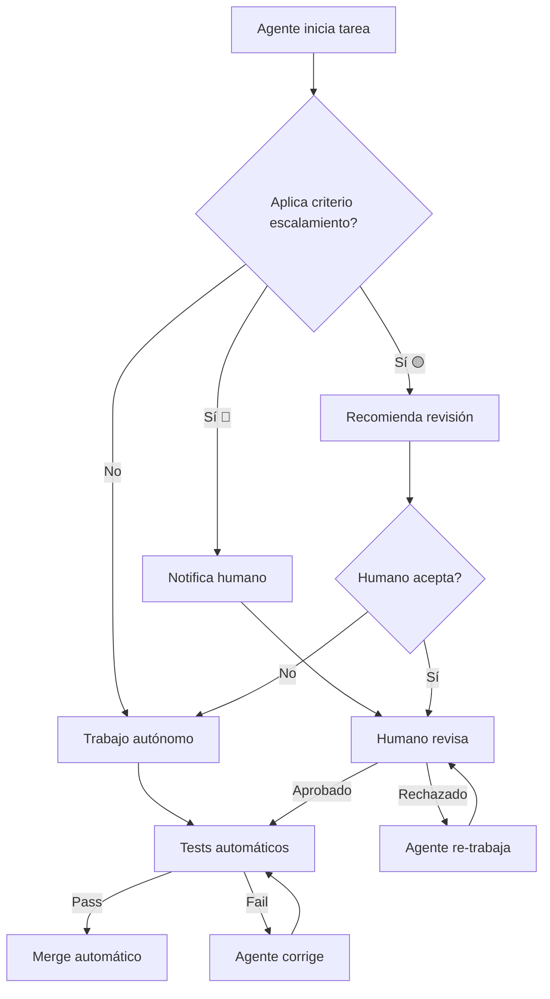
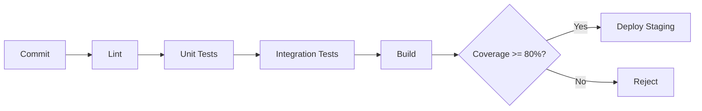

# Modelo de Desarrollo de Software

> **Versión:** 1.0.0  
> **Fecha:** Abril 2026  
> **Descripción:** Modelo formal de desarrollo de software basado en agentes AI para equipos pequeños (3-5 personas) especializados en Web Apps, APIs/Backend y Data/Analytics.

---

## Tabla de Contenidos

1. [Roles y Agentes](#1-roles-y-agentes)
2. [Arquitectura de Referencia](#2-arquitectura-de-referencia)
3. [Plantillas de Proyectos](#3-plantillas-de-proyectos)
4. [Protocolos de Pruebas](#4-protocolos-de-pruebas)
5. [Protocolos de Despliegue](#5-protocolos-de-despliegue)
6. [Esquemas de Soporte](#6-esquemas-de-soporte)

---

## 1. Roles y Agentes

### 1.1 Estructura del Equipo (3-5 personas)

| Rol | Responsable | Descripción |
|-----|-------------|-------------|
| **Arquitecto/Lead Developer** | Humano | Diseño de arquitectura, decisiones técnicas, code review |
| **Full-Stack Developer** | Humano + AI | Desarrollo frontend y backend |
| **Data/Backend Developer** | Humano + AI | APIs, servicios, análisis de datos, BD |
| **QA Engineer** | AI | Pruebas automatizadas, validación, reporting |
| **DevOps Engineer** | AI | CI/CD, infraestructura, despliegue, monitoreo |

### 1.2 Agentes AI Especializados

#### 💻 AGENTES DE DESARROLLO

#### 🤖 Agente: `frontend-dev`
- **Uso:** Desarrollo de interfaces de usuario, componentes React/Next.js, TypeScript, TailwindCSS
- **Trigger:** "Crea un componente de...", "Implementa la UI de...", "Estila el formulario de..."
- **Capacidades:**
  - Crear componentes React reutilizables
  - Implementar páginas completas con Next.js App Router
  - Integrar APIs del backend
  - Manejar estado con Zustand/Redux
  - Responsive design y accesibilidad
  - Validación de formularios
- **Autonomía:** 
  - ✅ Autónomo: Componentes UI, páginas simples, styling
  - ⚠️ Asistido: Lógica de negocio compleja, arquitectura de estado
- **Ejemplo:** "Crea un dashboard con gráficos de usuarios activos"

#### 🤖 Agente: `backend-dev`
- **Uso:** APIs REST, servicios Node.js/Express, autenticación, base de datos PostgreSQL
- **Trigger:** "Crea un endpoint para...", "Implementa autenticación...", "Modela la BD para..."
- **Capacidades:**
  - Crear endpoints RESTful con Express/FastAPI
  - Implementar autenticación JWT/OAuth
  - Diseñar esquemas de base de datos (Prisma/SQLAlchemy)
  - Middleware de validación y error handling
  - Integración con Redis para cache/queues
- **Autonomía:**
  - ✅ Autónomo: CRUD endpoints, modelos de datos, middleware básico
  - ⚠️ Asistido: Arquitectura de microservicios, optimización de queries complejos
- **Ejemplo:** "Crea API de gestión de usuarios con roles y permisos"

#### 🤖 Agente: `data-engineer`
- **Uso:** ETL pipelines, análisis de datos con Pandas, visualización, reportes
- **Trigger:** "Analiza este dataset...", "Crea un pipeline ETL para...", "Genera un reporte de..."
- **Capacidades:**
  - Extraer datos de APIs, BDs, archivos
  - Transformar y limpiar datos con Pandas
  - Crear visualizaciones (matplotlib, plotly)
  - Generar reportes automatizados
  - Análisis estadístico
- **Autonomía:**
  - ✅ Autónomo: Análisis exploratorio, limpieza de datos, gráficos estándar
  - ⚠️ Asistido: Modelos predictivos, pipelines complejos con múltiples fuentes
- **Ejemplo:** "Analiza tendencias de ventas del último trimestre"

#### 🤖 Agente: `fullstack-dev`
- **Uso:** Desarrollo end-to-end, integración frontend+backend, features completas
- **Trigger:** "Implementa la feature de...", "Crea un sistema completo de..."
- **Capacidades:**
  - Desarrollar features completas (UI + API + BD)
  - Integración entre capas
  - Refactorización cross-layer
  - Prototipado rápido de MVPs
- **Autonomía:**
  - ✅ Autónomo: Features CRUD completas, prototypes MVP
  - ⚠️ Asistido: Sistemas distribuidos, arquitectura de alta disponibilidad
- **Ejemplo:** "Crea sistema completo de notificaciones push"

#### 🔧 AGENTES DE SOPORTE

#### 🤖 Agente: `general-purpose`
- **Uso:** Investigación, búsqueda de código, tareas multi-paso genéricas
- **Trigger:** Búsquedas complejas, exploración de codebase, preguntas técnicas
- **Ejemplo:** "Busca todas las implementaciones de autenticación"

#### 🤖 Agente: `devops-deployment-expert`
- **Uso:** Infraestructura, CI/CD, servidores, bases de datos, optimización
- **Trigger:** Deployments, configuración de servidores, optimización DB, GitHub workflows
- **Ejemplo:** "Configura pipeline de GitHub Actions para producción"

#### 🤖 Agente: `analista-datos-encuestas`
- **Uso:** Análisis de datos de encuestas, estadísticas, reportes estructurados
- **Trigger:** Datos de encuestas, métricas de satisfacción, análisis exploratorio
- **Ejemplo:** "Analiza los datos de satisfacción del cliente"

#### 🤖 Agente: `Explore`
- **Uso:** Exploración rápida de codebase, búsqueda de patrones
- **Trigger:** Búsquedas de archivos, estructuras, convenciones de código
- **Ejemplo:** "Encuentra todos los componentes React"

### 1.3 Skills (Habilidades Especiales)

| Skill | Comando | Uso |
|-------|---------|-----|
| **loop** | `/loop` | Tareas recurrentes programadas |
| **qc-helper** | `/qc-helper` | Ayuda sobre configuración de Qwen |
| **review** | `/review` | Code review de cambios/PRs |

### 1.4 Matriz de Responsabilidades

| Fase | Rol Humano | Agente AI Principal | Agente Support | Modo | Aprobación |
|------|------------|---------------------|----------------|------|------------|
| **Planificación** | Arquitecto | `fullstack-dev` | `general-purpose` | ⚠️ Asistido | Humano |
| **Arquitectura** | Arquitecto | `fullstack-dev` | `devops-deployment-expert` | ⚠️ Asistido | Humano |
| **UI Components** | Full-Stack | `frontend-dev` | `Explore` | ✅ Autónomo | Auto (review) |
| **Páginas/Vistas** | Full-Stack | `frontend-dev` | - | ✅ Autónomo | Auto (review) |
| **API Endpoints** | Backend | `backend-dev` | `Explore` | ✅ Autónomo | Auto (review) |
| **Modelos BD** | Backend | `backend-dev` | - | ✅ Autónomo | Humano |
| **Auth System** | Backend | `backend-dev` | `devops-deployment-expert` | ⚠️ Asistido | Humano |
| **Feature CRUD** | Full-Stack | `fullstack-dev` | - | ✅ Autónomo | Auto (review) |
| **MVP Prototyping** | Arquitecto | `fullstack-dev` | `frontend-dev` + `backend-dev` | ✅ Autónomo | Humano |
| **Data Analysis** | Data/Backend | `data-engineer` | `analista-datos-encuestas` | ✅ Autónomo | Humano |
| **ETL Pipelines** | Data/Backend | `data-engineer` | - | ⚠️ Asistido | Humano |
| **Pruebas Unitarias** | Developer | `review` | - | ✅ Autónomo | Auto |
| **Pruebas Integración** | QA | `devops-deployment-expert` | `backend-dev` | ⚠️ Asistido | Humano |
| **CI/CD Setup** | DevOps | `devops-deployment-expert` | - | ✅ Autónomo | Humano |
| **Deploy Staging** | DevOps | `devops-deployment-expert` | - | ✅ Autónomo | Auto |
| **Deploy Production** | Arquitecto | `devops-deployment-expert` | - | ⚠️ Asistido | Humano |
| **Monitoreo** | DevOps | `loop` (automated) | - | ✅ Autónomo | Auto |

### 1.5 Cuándo Usar Cada Agente

#### Escenarios de Desarrollo Típicos

**"Necesito crear una página de login completa"**
→ `fullstack-dev` (autónomo): UI + API + validación

**"Crea los componentes del dashboard"**
→ `frontend-dev` (autónomo): Charts, cards, tables

**"Implementa API de gestión de productos"**
→ `backend-dev` (autónomo): CRUD endpoints + models

**"Analiza datos de ventas del Q4"**
→ `data-engineer` (autónomo): ETL + análisis + gráficos

** "Crea sistema de notificaciones en tiempo real"**
→ `fullstack-dev` + `backend-dev` (asistido): WebSockets + UI + queue

**"Optimiza queries lentos en producción"**
→ `backend-dev` + `devops-deployment-expert` (asistido): Query analysis + indexing

**"Configura deploy automático"**
→ `devops-deployment-expert` (autónomo): GitHub Actions + Docker

### 1.6 Reglas de Escalamiento (Autónomo → Asistido)

#### Criterios de Escalamiento

Un agente trabaja de forma **autónoma (✅)** por defecto, pero debe escalar a **asistido (⚠️)** cuando se cumple ALGUNA de estas condiciones:

##### 🔴 Escalamiento Automático (Obligatorio)

| Condición | Ejemplo | Acción |
|-----------|---------|--------|
| **Seguridad** | Autenticación, JWT, OAuth, permisos | Requiere revisión humana antes de merge |
| **Datos sensibles** | Queries a producción, migraciones de BD | Aprobación explícita del Arquitecto |
| **Cambios breaking** | API version changes, schema changes | Review + testing extra obligatorio |
| **Producción** | Deploy a producción, cambios en infra | Arquitecto debe aprobar |
| **Costos** | Servicios cloud nuevos, APIs de pago | Evaluación de impacto económico |

##### 🟡 Escalamiento Recomendado

| Condición | Ejemplo | Acción |
|-----------|---------|--------|
| **Complejidad alta** | +500 líneas de código, múltiples archivos | Sugerir revisión de otro developer |
| **Performance crítico** | Queries complejos, loops grandes | Benchmark antes/después requerido |
| **Tecnología nueva** | Librerías/paquetes no usados en el proyecto | Investigar y documentar decisiones |
| **Integración externa** | APIs de terceros, webhooks | Testing manual requerido |
| **UX crítico** | Flujos de usuario principales (login, checkout) | QA manual recomendado |

##### 🟢 Permanece Autónomo

| Condición | Ejemplo | Proceso |
|-----------|---------|---------|
| **CRUD estándar** | Endpoints GET/POST/PUT/DELETE | Tests automáticos → merge |
| **Componentes UI** | Botones, cards, formularios simples | Linting + tests → merge |
| **Bug fixes menores** | Typos, estilos, errores obvios | Auto-merge si tests pasan |
| **Documentación** | READMEs, comentarios, guías | Merge directo |
| **Análisis exploratorio** | Gráficos, estadísticas descriptivas | Review opcional |

#### Matriz de Decisión

```
¿El cambio involucra...?

1. ¿Datos de usuarios o seguridad?
   ├─ SÍ → 🔴 ESCALAR (revisión humana obligatoria)
   └─ NO → Continuar

2. ¿Afecta producción directamente?
   ├─ SÍ → 🔴 ESCALAR (aprueba Arquitecto)
   └─ NO → Continuar

3. ¿+500 líneas o +5 archivos?
   ├─ SÍ → 🟡 RECOMENDAR revisión
   └─ NO → Continuar

4. ¿Tecnología no probada en proyecto?
   ├─ SÍ → 🟡 DOCUMENTAR decisiones
   └─ NO → Continuar

5. ¿Es CRUD/UI estándar o bug fix menor?
   ├─ SÍ → ✅ AUTÓNOMO (auto-merge si tests OK)
   └─ NO → 🟡 EVALUAR caso por caso
```

#### Proceso de Escalamiento



#### SLA de Respuesta por Escalamiento

| Prioridad | Tipo | Respuesta Máx | Ejemplo |
|-----------|------|---------------|---------|
| **P0** | Producción caída | 15 min | Server down, DB corrupt |
| **P1** | Security/Blocking | 1 hora | Auth bug, deployment blocked |
| **P2** | Feature compleja | 4 horas | Sistema de pagos |
| **P3** | Mejora/Refactor | 24 horas | Optimización, tech debt |

---

## 2. Arquitectura de Referencia

### 2.1 Stack de Desarrollo Predeterminado

#### Frontend
| Tecnología | Versión | Propósito |
|------------|---------|-----------|
| **React** | 18+ | UI Library |
| **TypeScript** | 5+ | Type Safety |
| **Next.js** | 14+ | Framework (SSR/SSG) |
| **TailwindCSS** | 3+ | Styling |
| **Zustand/Redux** | Latest | State Management |

#### Backend
| Tecnología | Versión | Propósito |
|------------|---------|-----------|
| **Node.js** | 20+ LTS | Runtime |
| **Express.js / FastAPI** | Latest | API Framework |
| **Python** | 3.11+ | Data/ML Services |
| **PostgreSQL** | 15+ | Base de Datos Principal |
| **Redis** | 7+ | Cache/Queue |

#### DevOps & Infraestructura
| Tecnología | Propósito |
|------------|-----------|
| **Docker** | Containerización |
| **GitHub Actions** | CI/CD |
| **HAProxy / Nginx** | Load Balancer / Reverse Proxy |
| **PM2** | Process Manager |

#### Testing
| Herramienta | Tipo |
|-------------|------|
| **Jest** | Unit Testing (JS/TS) |
| **pytest** | Unit Testing (Python) |
| **Playwright** | E2E Testing |
| **Supertest** | API Testing |

### 2.2 Patrones Arquitectónicos

#### Web Apps
```
┌─────────────────────────────────────────┐
│           Next.js (Frontend)            │
│   ┌──────────┬──────────┬──────────┐   │
│   │  Pages   │ Components │ Hooks  │   │
│   └──────────┴──────────┴──────────┘   │
└──────────────┬──────────────────────────┘
               │ API Routes
┌──────────────▼──────────────────────────┐
│         Backend Services                │
│   ┌──────────┬──────────┬──────────┐   │
│   │ Express  │ FastAPI  │  Auth    │   │
│   └──────────┴──────────┴──────────┘   │
└──────────────┬──────────────────────────┘
               │
┌──────────────▼──────────────────────────┐
│         Data Layer                      │
│   ┌──────────┬──────────┬──────────┐   │
│   │PostgreSQL│  Redis   │  S3      │   │
│   └──────────┴──────────┴──────────┘   │
└─────────────────────────────────────────┘
```

#### APIs/Backend
```
┌─────────────────────────────────────────┐
│           API Gateway                   │
│         (Nginx/HAProxy)                 │
└──────────────┬──────────────────────────┘
               │
┌──────────────▼──────────────────────────┐
│         Microservicios                  │
│   ┌──────────┬──────────┬──────────┐   │
│   │  Users   │  Orders  │ Analytics│   │
│   └──────────┴──────────┴──────────┘   │
└──────────────┬──────────────────────────┘
               │
┌──────────────▼──────────────────────────┐
│   Message Queue (Redis/RabbitMQ)        │
└─────────────────────────────────────────┘
```

#### Data/Analytics
```
┌─────────────────────────────────────────┐
│         Data Sources                    │
│   ┌──────────┬──────────┬──────────┐   │
│   │  APIs    │  DBs     │  Files   │   │
│   └──────────┴──────────┴──────────┘   │
└──────────────┬──────────────────────────┘
               │
┌──────────────▼──────────────────────────┐
│     ETL/Processing (Python/Pandas)      │
└──────────────┬──────────────────────────┘
               │
┌──────────────▼──────────────────────────┐
│         Storage & Visualization         │
│   ┌──────────┬──────────┬──────────┐   │
│   │PostgreSQL│ Dashboards│ Reports │   │
│   └──────────┴──────────┴──────────┘   │
└─────────────────────────────────────────┘
```

---

## 3. Plantillas de Proyectos

### 3.1 Estructura Base (Todos los Proyectos)

```
project-name/
├── .github/
│   └── workflows/
│       ├── ci.yml
│       └── deploy.yml
├── docs/
│   ├── ARCHITECTURE.md
│   ├── API.md
│   └── DEPLOYMENT.md
├── src/
├── tests/
├── .gitignore
├── .env.example
├── README.md
└── package.json / requirements.txt
```

### 3.2 Template: Web App (Next.js)

```
web-app/
├── src/
│   ├── app/              # Next.js App Router
│   │   ├── (auth)/      # Route groups
│   │   ├── (dashboard)/
│   │   └── api/         # API routes
│   ├── components/
│   │   ├── ui/          # Base components
│   │   └── features/    # Feature-specific
│   ├── hooks/           # Custom hooks
│   ├── lib/             # Utilities
│   ├── stores/          # State management
│   └── types/           # TypeScript definitions
├── public/
├── prisma/              # Database schema
└── tailwind.config.ts
```

### 3.3 Template: API/Backend (Node.js)

```
api-backend/
├── src/
│   ├── controllers/
│   ├── services/
│   ├── models/
│   ├── routes/
│   ├── middleware/
│   ├── utils/
│   └── index.ts
├── tests/
│   ├── unit/
│   ├── integration/
│   └── e2e/
├── prisma/
│   └── schema.prisma
└── docker-compose.yml
```

### 3.4 Template: Data/Analytics (Python)

```
data-analytics/
├── src/
│   ├── data/
│   │   ├── extract.py
│   │   ├── transform.py
│   │   └── load.py
│   ├── analysis/
│   ├── models/
│   ├── visualization/
│   └── config.py
├── notebooks/
├── data/
│   ├── raw/
│   ├── processed/
│   └── output/
├── reports/
└── requirements.txt
```

---

## 4. Protocolos de Pruebas

### 4.1 Pirámide de Testing

```
           /\
          /  \
         / E2E \        → Playwright (10%)
        /______\
       /        \
      / Integration\   → Supertest/pytest (20%)
     /______________\
    /                \
   /    Unit Tests    \ → Jest/pytest (70%)
  /____________________\
```

### 4.2 Cobertura Mínima Requerida

| Tipo | Cobertura Mínima | Herramienta |
|------|------------------|-------------|
| Unitarios | 80%+ | Jest / pytest |
| Integración | 70%+ | Supertest / requests |
| E2E | Flujos críticos | Playwright |

### 4.3 Workflow de Testing



### 4.4 Comandos Estándar

```bash
# Unit tests
npm run test
npm run test:coverage

# Integration tests
npm run test:integration

# E2E tests
npm run test:e2e

# All tests
npm run test:all
```

---

## 5. Protocolos de Despliegue

### 5.1 Environments

| Environment | Propósito | URL | Auto-Deploy |
|-------------|-----------|-----|-------------|
| **Development** | Desarrollo local | localhost | N/A |
| **Staging** | Testing/QA | staging.domain.com | En push a `develop` |
| **Production** | Usuarios finales | domain.com | En merge a `main` |

### 5.2 CI/CD Pipeline

```yaml
# .github/workflows/ci.yml
name: CI/CD Pipeline

on:
  push:
    branches: [develop, main]
  pull_request:
    branches: [main]

jobs:
  test:
    runs-on: ubuntu-latest
    steps:
      - uses: actions/checkout@v4
      - uses: actions/setup-node@v4
      - run: npm ci
      - run: npm run lint
      - run: npm run test:coverage
      - run: npm run build

  deploy-staging:
    needs: test
    if: github.ref == 'refs/heads/develop'
    runs-on: ubuntu-latest
    steps:
      - run: echo "Deploying to staging..."

  deploy-production:
    needs: test
    if: github.ref == 'refs/heads/main'
    runs-on: ubuntu-latest
    steps:
      - run: echo "Deploying to production..."
```

### 5.3 Estrategia de Deploy

| Estrategia | Uso | Descripción |
|------------|-----|-------------|
| **Rolling** | Producción | Actualización gradual de instancias |
| **Blue-Green** | Crítico | Dos ambientes idénticos, switch instantáneo |
| **Canary** | Features nuevos | 10% tráfico → 50% → 100% |

### 5.4 Rollback Automático

- **Trigger:** Error rate > 5% en 5 minutos
- **Acción:** Revert al último deploy exitoso
- **Notificación:** Slack/Email al equipo

---

## 6. Esquemas de Soporte

### 6.1 Niveles de Soporte

| Nivel | Descripción | Responsable | SLA |
|-------|-------------|-------------|-----|
| **L1** | Issues básicos, FAQs | Automated/Bot | Inmediato |
| **L2** | Bugs, configuración | Developer | 4 horas |
| **L3** | Issues críticos, arquitectura | Arquitecto | 1 hora |

### 6.2 Monitoreo

| Métrica | Herramienta | Alerta |
|---------|-------------|--------|
| Uptime | UptimeRobot | < 99.9% |
| Response Time | New Relic/Datadog | > 500ms |
| Error Rate | Sentry | > 1% |
| DB Performance | pg_stat_statements | Queries lentas |

### 6.3 On-Call Rotation (si aplica)

```
Semana 1: Developer A
Semana 2: Developer B
Semana 3: Arquitecto
```

### 6.4 Runbooks

Cada servicio debe tener un runbook con:
- Descripción del servicio
- Dependencies
- Comandos de troubleshooting
- Escalamiento
- Contactos

---

## Apéndice

### A.1 Convenciones de Commits

```
<type>(<scope>): <description>

feat(auth): add JWT validation
fix(api): resolve null pointer in users endpoint
docs(readme): update installation steps
refactor(core): extract validation logic
test(users): add unit tests for registration
```

### A.2 Git Flow

```
main ──────────────────────────────────►
        ↑ merge        ↑ merge
develop ───────────────┼──────────────►
        ↑ merge     ↑ merge
feature/1 ──┘      │
feature/2 ─────────┘
```

### A.3 Definition of Done (DoD)

- [ ] Código implementado
- [ ] Tests unitarios passing (>80% coverage)
- [ ] Tests de integración passing
- [ ] Code review aprobado
- [ ] Documentación actualizada
- [ ] Deploy en staging exitoso
- [ ] QA aprobado
